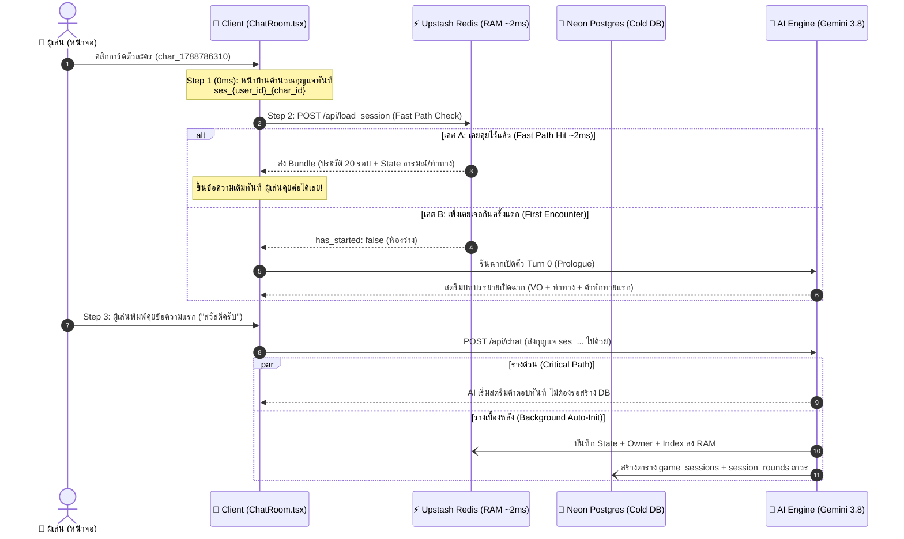

# 🏛️ The Soul App: Core Architecture & Identity Pillars (พิมพ์เขียวแกนกลางสูงสุดของระบบ)
> **เอกสารฉบับทางการ (The Definitive Master Architecture Document)**  
> **วัตถุประสงค์:** บันทึกโครงสร้างแกนกลาง, ปรัชญาการออกแบบ, โฟลว์การทำงานจริง, มาตรฐานความปลอดภัย, และการเชื่อมต่อ เพื่อเป็นเสาหลัก (North Star) ให้ผู้พัฒนาและ AI เข้าใจตรงกัน 100% ตลอดไป ไม่ว่าจะผ่านการพัฒนายาวนานแค่ไหน

---

## 🧭 1. ปรัชญาสูงสุดของระบบ (The Core Philosophy)

The Soul App ถูกสร้างขึ้นภายใต้ปรัชญา **"ถือกุญแจเข้าห้องได้ทันทีใน 0ms (Zero-Handshake Architecture)"**:

```text
┌─────────────────────────────────────────────────────────────┐
│                 ❌ ระบบแบบเดิม (Traditional Hotel)           │
│  ผู้เล่นต้องแวะ "เคาน์เตอร์โรงแรม" ทุกครั้ง (POST /api/start_session)│
│  เพื่อรอให้เซิร์ฟเวอร์สุ่มเลขห้อง (UUID) ส่งกลับมา -> ช้าและค้าง   │
└─────────────────────────────────────────────────────────────┘
                             VS
┌─────────────────────────────────────────────────────────────┐
│                 ✅ ระบบแบบใหม่ของเรา (Zero-Handshake)        │
│  ผู้เล่นและตัวละครคำนวณ "กุญแจห้องถาวร" ได้เองในมือ (0ms)       │
│  ses_{user_id}_{char_id} -> เดินไปไขห้องใน RAM (2ms) ได้ทันที │
└─────────────────────────────────────────────────────────────┘
```

1. **Pure Mathematics $O(1)$:** หมายเลขห้อง (Session ID) ไม่ใช่เลขสุ่ม แต่เป็นผลลัพธ์ของสมการคณิตศาสตร์ตายตัวที่หน้าบ้านและหลังบ้านคำนวณได้ตรงกันเสมอ
2. **Zero Network Bottleneck:** ผู้เล่นก้าวเท้าเข้าห้องแชทได้ใน **0 มิลลิวินาที** โดยไม่ต้องเสียเวลารอ Network Round-Trip จากเซิร์ฟเวอร์ก่อนเปิดหน้าจอ
3. **Optimistic Parallel Execution:** ตอบสนองความรู้สึกผู้เล่นก่อน (AI ตอบทันที) แล้วแอบบันทึกฐานข้อมูลลง RAM (Redis) และ ดิสก์ถาวร (Neon DB) ในเบื้องหลังแบบ Asynchronous

---

## 🔑 2. มาตรฐาน 4 เสาหลักของไอดี (The 4 Identity Pillars)

ระบบทั้งหน้าบ้าน (TypeScript) และหลังบ้าน (Python) ยึดถือข้อกำหนดคำนำหน้า (Prefix Standards) ดังต่อไปนี้อย่างเคร่งครัด:

```text
1. User ID (ผู้เล่น)       : "gst_{timestamp}_{random}"  (หรือ "usr_{google_sub_id}")
2. Character ID (ตัวละคร)  : "char_{id}"
3. Session ID (กุญแจห้อง)  : "ses_{user_id}_{char_id}"
4. World ID (เวที/ฉากโลก)  : "world_{id}" (หรือ "draft_{timestamp}")
```

| เสาหลัก | รูปแบบสเปก (Standard) | ตัวอย่างค่าจริง | หน้าที่และที่จัดเก็บ |
| :--- | :--- | :--- | :--- |
| **1. User ID (Guest)** | `gst_{timestamp}_{random}` | `gst_1789411381_50b6` | ผู้ใช้ใหม่นิรนาม สร้างทันทีบนเครื่อง ไม่ต้องสมัครสมาชิก (`localStorage: the_soul_guest_id`) |
| **1. User ID (Member)**| `usr_{google_sub_id}` | `usr_112345678901` | สมาชิกที่ยืนยันตัวตนผ่าน Google OAuth (`localStorage: the_soul_user`) |
| **2. Character ID** | `char_{id}` | `char_1788786310` | รหัสประจำตัวของตัวละคร ป้องกันการสับสนด้วยการบังคับ Prefix `char_` เสมอ |
| **3. Session ID** | `ses_{user_id}_{char_id}` | `ses_gst_1789..._char_1788...` | **หัวใจของระบบ:** กุญแจห้องแชทที่คำนวณล่วงหน้าได้ทันที 1 ห้องต่อ 1 คู่ความสัมพันธ์ |
| **4. World ID** | `world_{id}` / `draft_{ts}` | `world_1788786310` | เวทีเรื่องราว, เควสต์ (Beats), ฉากเปิดตัว (Prologue), และชุดเริ่มต้น |

---

## ⚡ 3. โฟลว์การทำงานจริงตั้งแต่คลิกจนพิมพ์คุย (The Complete Lifecycle)



### รายละเอียดแต่ละขั้นตอน:
1. **เข้าห้องแชท (Client 0ms):**
   - เมื่อผู้เล่นคลิกการ์ดตัวละคร ตัวแปร `user_id` และ `character_id` ถูกนำมาประกบกันผ่านฟังก์ชัน `buildSessionId` หน้าบ้านจะสั่ง `setSessionId(deterministicSid)` ทันที
2. **ส่องห้องใน RAM (Upstash Fast Path ~2ms):**
   - ส่งคำขอไปที่ `POST /api/load_session`
   - หลังบ้านใช้ Pipeline คำสั่งเดียวตรวจหา:
     - `session:{session_id}:state`
     - `session:{session_id}:rounds`
     - `session:{session_id}:owner`
   - หากมีข้อมูล ส่งกลับหน้าบ้านให้แสดงผลทันทีโดยไม่ต้องเปิดฐานข้อมูล PostgreSQL
3. **ส่งข้อความแรก (Zero-Handshake Auto-Init):**
   - ผู้เล่นไม่ต้องรอให้เคาน์เตอร์เปิดห้อง พิมพ์ข้อความแล้วกดส่งได้เลย
   - ฝั่ง Backend มีระบบ **Zero-Handshake Auto-Init** หากเป็นห้องใหม่ จะยอมให้เริ่มคุยทันที พร้อมสร้างเรคคอร์ดลง Neon DB และ Redis ในเบื้องหลังแบบ Asynchronous

---

## 🛡️ 4. สถาปัตยกรรมความปลอดภัย (IDOR Protection Gate)

การที่กุญแจห้องถูกสร้างที่ฝั่งไคลเอนต์ (Client-Side) ได้นั้น มีระบบป้องกันความปลอดภัย **3 ชั้น** เพื่อไม่ให้ใครสามารถแอบดูหรือขโมยห้องแชทของผู้อื่น:

```text
[ ผู้ไม่หวังดี นาย A ]
       │ พยายามยิงกุญแจของนาย B: "ses_usr_นายB_char_1788786310"
       ▼
┌────────────────────────────────────────────────────────┐
│ 🛡️ ประตูด่านตรวจหลังบ้าน (IDOR Security Gate)          │
├────────────────────────────────────────────────────────┤
│ 1. ถอดรหัสหา Owner ใน RAM: session:{session_id}:owner   │
│    -> เจ้าของจริงคือ: "usr_นายB"                       │
│                                                        │
│ 2. ตรวจสอบบัตรประชาชนผู้เรียก:                           │
│    -> ผู้เรียกคือ: "usr_นายA"                          │
│                                                        │
│ 3. เปรียบเทียบ: "usr_นายA" == "usr_นายB" หรือไม่?        │
│    -> ไม่ตรงกัน! 🚨 สั่งตัดการเชื่อมต่อทันที             │
└────────────────────────────────────────────────────────┘
       │
       ▼
  HTTP 403 Forbidden: "Unauthorized session access"
```

1. **Key-Embedded Identity:** ตัวกุญแจถูกสลักชื่อ `user_id` ของเจ้าของไว้ในชื่อกุญแจเสมอ
2. **Server-Side Ownership Cache:** ทุกครั้งที่มีการสร้างห้อง Redis จะจดจำคีย์ `session:{session_id}:owner` ไว้อย่างเหนียวแน่น
3. **Pre-flight Gate Enforcement:** ทุก Endpoint (`/load_session`, `/chat`, `/archive`) จะเปรียบเทียบผู้เรียกกับ `owner` เสมอ หากไม่ตรงกันจะคืนค่า `403 Forbidden` ทันทีและไม่ส่งข้อมูลใดๆ กลับไป

---

## 🚀 5. กลไกการส่งมอบเงียบ (Silent Handover Mechanism)

แก้ปัญหาคลาสสิกของเว็บแชทบอท ที่ผู้เล่นคุยในฐานะ Guest แล้วพอกด **"ล็อกอิน Google"** ข้อมูลแชทกลับหายหรือหน้าเว็บรีเฟรชเริ่มใหม่:

```text
[ ขณะเป็น Guest ]
  🔑 กุญแจห้อง: ses_gst_1789411381_50b6_char_1788786310
  📦 ข้อมูล: คุยค้างไว้ 5 รอบ, ค่า Affection = 30, เหรียญคงเหลือ 40
       │
       │ (ผู้เล่นกดปุ่ม Sign in with Google)
       ▼
┌───────────────────────────────────────────────────────────────────┐
│ ⚡ Silent Handover Engine (ทำงานเสร็จใน ~5ms)                      │
├───────────────────────────────────────────────────────────────────┤
│ 1. ใน Upstash Redis RAM:                                          │
│    - คำนวณกุญแจใหม่: ses_usr_112345678901_char_1788786310          │
│    - คัดลอก State + Rounds ทั้งหมดข้ามไปยังกุญแจใหม่แบบ Atomic    │
│    - เปลี่ยนชื่อเจ้าของ owner = usr_112345678901                 │
│    - ล้างกุญแจ Guest เดิมออกจาก RAM ทันที                          │
│                                                                   │
│ 2. ใน Neon PostgreSQL (Transaction เดียว):                        │
│    - UPDATE game_sessions SET id = new_sid, user_id = new_user_id │
│    - UPDATE session_rounds SET session_id = new_sid               │
│    - โอนย้ายเหรียญและประวัติการเติมเงินจาก Guest -> Member         │
└───────────────────────────────────────────────────────────────────┘
       │
       ▼
[ หน้าจอผู้เล่น ]
  หน้าแชทไม่กระพริบ ไม่โหลดใหม่ คุยต่อประโยคที่ 6 ได้ทันทีแบบ 100% ไร้รอยต่อ!
```

---

## 💾 6. โครงสร้างหน่วยความจำ 2 ระดับ (Tiered Data Architecture)

| ระดับหน่วยความจำ | เทคโนโลยี | คีย์ / ตาราง | หน้าที่และนโยบายการจัดเก็บ |
| :--- | :--- | :--- | :--- |
| **⚡ Hot Cache (RAM)** | **Upstash Redis** | `session:{session_id}:state`<br>`session:{session_id}:rounds`<br>`session:{session_id}:owner`<br>`character:{char_id}:blueprint` | **ความเร็วตอบสนอง ~2ms:**<br>- ล็อครอบแชทไว้ที่ 20 รอบล่าสุด (`LTRIM`)<br>- มี **Auto TTL 7 วัน** คอยคืน RAM อัตโนมัติ ป้องกันแคชล้น |
| **💾 Cold Storage (ถาวร)** | **Neon PostgreSQL** | `users`<br>`game_sessions`<br>`session_rounds` (JSONB)<br>`wallets` | **คลังบันทึกถาวรไม่มีวันสูญหาย:**<br>- บันทึกประวัติการแชททุกเทิร์นครบ 100%<br>- เป็นแหล่งดึงข้อมูล Fallback ในกรณีที่ไม่ได้เข้าห้องนานจน Redis TTL หมดอายุ |

---

## 📁 7. สารบัญไฟล์โค้ดอ้างอิงของระบบจริง (Source of Truth Directory)

หากต้องการตรวจสอบหรือต่อยอดในอนาคต โค้ดทั้งหมดที่รองรับสถาปัตยกรรมนี้ประจำการอยู่ที่:

### ฝั่ง Backend (`the_soul_app/backend/`)
- [`engine/identity.py`](file:///Users/aliceer/solccai/the_soul_app/backend/engine/identity.py): ตัวกำกับและแปลง ID มาตรฐาน (`generate_guest_id`, `build_session_id`, `parse_session_id`)
- [`engine/redis_cache.py`](file:///Users/aliceer/solccai/the_soul_app/backend/engine/redis_cache.py): ตัวจัดการ Upstash Redis Hot Cache (`get_session_bundle`, `migrate_session`, TTL)
- [`engine/postgres_core.py`](file:///Users/aliceer/solccai/the_soul_app/backend/engine/postgres_core.py): ตัวจัดการฐานข้อมูลถาวร Neon DB (`migrate_guest_session`, `clear_session_rounds`)
- [`engine/pipeline.py`](file:///Users/aliceer/solccai/the_soul_app/backend/engine/pipeline.py): ตัวขับเคลื่อน AI Gemini & Zero-Handshake Auto-Init
- [`api/routes.py`](file:///Users/aliceer/solccai/the_soul_app/backend/api/routes.py): Endpoint รับส่งข้อมูล (`/load_session`, `/start_session`, `/chat`, `/auth/google`)

### ฝั่ง Frontend (`the_soul_app/frontend/src/features/chat/`)
- [`identity.ts`](file:///Users/aliceer/solccai/the_soul_app/frontend/src/features/chat/identity.ts): ตัวกำกับและแปลง ID มาตรฐานฝั่ง TypeScript
- [`chatApi.ts`](file:///Users/aliceer/solccai/the_soul_app/frontend/src/features/chat/chatApi.ts): ตัวยิง API และสตรีมมิ่ง SSE ด้วย Deterministic Session ID
- [`components/chat-room/ChatRoom.tsx`](file:///Users/aliceer/solccai/the_soul_app/frontend/src/features/chat/components/chat-room/ChatRoom.tsx): ห้องสนทนาหลักที่ปลดล็อกระบบเข้าห้อง 0ms
