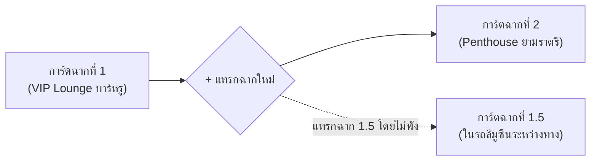

# The Soul Creator Studio — Design & Architecture Bible
*(คัมภีร์การออกแบบและสถาปัตยกรรมระบบสร้างตัวละครและสร้างโลก: The Muse & Genesis Studio)*

> **"Deciding what not to do is as important as deciding what to do."** — Steve Jobs  
> ปรัชญาการออกแบบหน้าสตูดิโอสร้างโลกและตัวละครของ The Soul: **"จากผืนผ้าใบที่ว่างเปล่า สู่การตกผลึกระดับมาสเตอร์พีซผ่านบทสนทนา (Conversational Co-Creation Sanctuary)"**

---

## 1. Core Philosophy & The Antigravity Paradigm Shift (ปรัชญาหลัก)

### 1.1 จาก "ฟอร์มกรอกข้อมูลที่น่าเบื่อ" สู่ "Co-Creation Sanctuary"
- **จุดบกพร่องของระบบเดิมทั่วไป:** เมื่อเปิดเข้ามาผู้ใช้จะพบหน้าต่างรกตา เต็มไปด้วยฟอร์มเปล่า 50 ช่อง และการ์ดทึบๆ กองทับถม ก่อให้เกิดอาการ **Creative Block** (สมองตื้อ ไม่รู้จะเริ่มกรอกอะไร)
- **สัจธรรมใหม่ของ The Soul Studio:** 
  1. **ผืนผ้าใบที่ว่างเปล่า (Blank Canvas):** เปิดเข้ามาเป็นห้องแชทมินิมอล คลีน 100% ไร้สิ่งรบกวนสายตา
  2. **Conversational Discovery:** ผู้เล่นคุยเล่าความฝัน ไอเดีย อารมณ์ หรือไวบ์ของตัวละครและโลกกับ The Muse อย่างอิสระ
  3. **Autonomous Planning Mode:** เมื่อข้อมูลตกผลึก AI จะตรวจจับความหนาแน่นของบริบทและแปลงเป็น "โหมดวางแผน" คล้ายประสบการณ์ใน Google Antigravity ทันที

---

## 2. The Left Sanctuary: ห้องแชทสร้างโลก (The Muse Chat)

พื้นที่ฝั่งซ้ายใช้ **Design Parity แบบ 1:1 กับห้องแชทสำหรับผู้เล่นจริง** เพื่อให้ครีเอเตอร์สัมผัสได้ถึงอารมณ์ของเกมตั้งแต่วินาทีแรกที่สร้าง:

```
+-------------------------------------------------------------------------+
| [Top Bar: The Muse Co-Creator | Status: Ready | Reset | View All Cards] |
+-------------------------------------------------------------------------+
|                                                                         |
|                                                                         |
|        [AI Bubble: Apple Charcoal #2f2f35]                              |
|        "ยินดีต้อนรับสู่ The Soul Studio วันนี้เราจะสร้างใครขึ้นมาดีครับ?"  |
|                                                                         |
|                                       [User Bubble: Velvet Carmine]     |
|                                       "อยากได้ตัวละครสาวนักสืบเย็นชา     |
|                                        แต่งตัวสไตล์ Techwear ดำด้าน..."   |
|                                                                         |
|  ✦ The Muse วิเคราะห์แรงขับและสรีระตัวละคร                                 |
|                                                                         |
|  [Planning Mode Capsule]                                                |
|  "ตอนนี้เราพร้อมสำหรับ 2 การ์ดแล้วนะ:                                      |
|   1. การ์ดสรีระ & ชุด Techwear                                          |
|   2. การ์ดจิตวิทยา & ความลับ                                            |
|   ต้องการคุยต่อ หรือเริ่มสร้างการ์ดเลยดีครับ?"                               |
|                                                                         |
|  [ 🚀 เริ่มลุยได้เลย (Interactive Button) ]                               |
|                                                                         |
+-------------------------------------------------------------------------+
|  (+) [ กล่องพิมพ์หมอนมน Pillow Glass Recipe... ] [🎙️] [ ➔ Carmine Send ]  |
+-------------------------------------------------------------------------+
```

### 2.1 Design Tokens ฝั่งแชท (ถอดแบบจาก Chat Room 100%)
- **Canvas Base:** สีดำด้านเนื้อแมตต์ `#090909` หรือ `#0F0F0F` ถนอมสายตาระดับลึก
- **Chat Input Bar Pillow Recipe:**
  - รูปทรง: แคปซูลหมอนมนเต็ม (`rounded-full`), สูง `min-h-[46px] sm:min-h-[48px]`
  - ผิวกระจก: `bg-white/[0.06] hover:bg-white/[0.09] focus-within:bg-white/[0.10] backdrop-blur-2xl border border-white/[0.10] focus-within:border-white/20 shadow-[inset_0_1px_0_rgba(255,255,255,0.12)]`
  - ปุ่มส่งคาร์ไมน์เรด: ทรงกลม 32px–34px `bg-[#EF264C] hover:bg-[#d91d40] text-white border border-white/20 shadow-[0_2px_8px_rgba(239,38,76,0.35)]`
- **บับเบิ้ลบทสนทนา (Chat Bubbles):**
  - **The Muse (AI):** Apple Charcoal `#2f2f35`, ตัวหนังสือขาวนวล `#F1F1F1` `text-[15px]`, Speech Tail ด้านล่างซ้าย
  - **Creator (User):** Velvet Carmine Gradient (`from-[#D22147] via-[#B8163A] to-[#8E0D29]`), ตัวหนังสือขาวคม `#FFFFFF`, Speech Tail ขวาล่าง
  - **Stage Action Direction:** ตัวเอียงสีเงินเงาจันทร์ `#A1A1A8` นำทางด้วยดาวจิ๋วสีเงิน `✦`

---

## 3. Autonomous Planning Mode & Interactive CTA (โหมดวางแผน)

หัวใจของประสบการณ์แบบ Antigravity ใน The Soul Creator Studio:

### 3.1 การตรวจจับและกระตุ้นโหมดวางแผน (Trigger Mechanism)
- **Single-Card Ready:** เมื่อคุยเฉพาะเจาะจงเรื่องใดเรื่องหนึ่งจนครบถ้วน (เช่น ชุดและทรงผม) AI จะส่งท้ายข้อความพร้อมปุ่มตัวเลือก:
  > *"ตอนนี้ข้อมูลในส่วน 'การ์ดสรีระ & ภาษากาย' ชัดเจนแล้วนะ อยากสร้างการ์ดนี้เลยไหม?"*
- **Multi-Card Synthesis (Planning Mode):** เมื่อการคุยครอบคลุมหลายหัวข้อ AI จะเปิดกรอบ **โหมดวางแผน** สรุปการ์ดทั้งหมดที่จะสร้าง พร้อมแจกแจงหัวข้อสั้นๆ
- **Dual Confirmation Method:**
  1. **Interactive Button:** ปุ่มแคปซูลกระจกฝ้าเรืองแสงอ่อนคาร์ไมน์ `[ 🚀 เริ่มลุยได้เลย ]` แตะครั้งเดียวสร้างทันที
  2. **Conversational Command:** พิมพ์ข้อความว่า *"ลุยเลย"*, *"สร้างเลย"*, *"จัดไป"* AI จะตรวจจับและเริ่มสร้างการ์ดทันทีเช่นกัน

---

## 4. The Right Studio Inspector: แผง HUD อัจฉริยะ (Right Panel)

แผงฝั่งขวาทำหน้าที่เป็น **Live Blueprint HUD** ที่จะเปิด-ปิดและปรับตัวตามสมาธิของครีเอเตอร์อย่างสมบูรณ์แบบ:

### 4.1 จังหวะการเปิด-ปิด (Unfold & Fold Lifecycle)
- **เริ่มต้น (Default State):** พับเก็บสนิท 100% (`isCollapsed = true`) ไม่แย่งสายตา
- **เด้งเปิดอัตโนมัติ (Auto-Unfold):**
  1. เมื่อระบบก้าวเข้าสู่ **"โหมดวางแผน (Planning Mode)"**
  2. เมื่อ **การ์ดสร้างเสร็จสดๆ ร้อนๆ (Card Ready Event)** เพื่ออวดผลงานให้ครีเอเตอร์ชื่นชม
- **อิสระในการพับเก็บ:** มีปุ่มพับเก็บ (Collapse / Close) ให้ผู้เล่นกดปิดเพื่อกลับไปคุยต่อได้ตลอดเวลา และจะเด้งใหม่อีกครั้งเมื่อการ์ดถัดไปพร้อม

### 4.2 การจัดวางแบบ Responsive Fluid Grid & Resizable Splitter
- มีตัวกั้นปรับขนาดได้ (**Resizable Splitter**) ที่ผู้ใช้สามารถลากขยายความกว้างได้อิสระ
- **Layout Adaptability:** การ์ดจะไม่ยึดติดกับ 1 คอลัมน์ยาวแคบๆ:
  - **ความกว้างปกติ (380px – 480px):** แสดงผล 1 คอลัมน์ เรียงลงมาอย่างประณีต
  - **เมื่อลากขยายกว้างขึ้น (600px – 900px+):** ระบบ CSS Grid จะปรับเป็นการ์ด **2 หรือ 3 คอลัมน์อัตโนมัติ** แสดงสเตตัสและมิติของโลกได้เต็มตา
- **โหมดเต็มจอ (Full-Screen Focus Mode):**
  - มีปุ่มขยายการ์ดเต็มจอ (Full Viewport)
  - เข้าสู่ **Direct Manipulation Mode:** ตรวจทาน อ่านรายละเอียดเชิงลึก และแก้ไขข้อความหรือเลื่อนสเตตัสบนการ์ดได้โดยตรงด้วยมือ
  - กดปิดโหมดเต็มจอเพื่อยุบกลับสู่ห้องแชท

---

## 5. Smoked Crystal Glass Recipe (สูตรกระจกคริสตัลรมควันสำหรับการ์ด)

ทุกการ์ดบนแผงขวา จะใช้สูตรเดียวกับ **การ์ดท่าทาง (Stance), การ์ดเวลา (Weather), และการ์ดหลอดความสัมพันธ์ (Gauge)** ใน HUD ของห้องแชทผู้เล่น:

### 5.1 CSS & Tailwind Recipe
```css
/* Smoked Crystal Glass Spec */
background: rgba(255, 255, 255, 0.04);
backdrop-filter: blur(24px);
-webkit-backdrop-filter: blur(24px);
border: 1px solid rgba(255, 255, 255, 0.07);
box-shadow: inset 0 1px 0 rgba(255, 255, 255, 0.08);
border-radius: 20px;
transition: all 0.2s cubic-bezier(0.16, 1, 0.3, 1);
```

### 5.2 กฎความงามและการเลือกสี (Zero-Glow & Dual-Tone)
- **ห้ามใส่ Neon Glow หรือ Drop Shadow หนาๆ เด็ดขาด:** ใช้การยกตัวด้วยความสว่างของกระจก 4% และเส้นขอบ Hairline 1px แทน
- **Typography:**
  - หัวข้อการ์ด (Card Title): ขาวนวลตา `#F1F1F1` `font-semibold text-[15px]`
  - ค่าสเตตัส / รายละเอียด: สีเทา Neutral Gray `#AAAAAA` หรือ `#D6D6DC` `text-[13px] leading-relaxed`
  - หลอดสเตตัส (Progress Bars): เส้นเกจบางละมุน น้ำหนักปกติ `font-normal` ไม่อ้วนหนา
  - ชิปและแท็ก (Pills): ทรงแคปซูลมนเต็ม `rounded-full` ขอบ 1px

---

## 6. Zero Empty Clutter & Overview Blueprint Policy

### 6.1 ไม่แสดงการ์ดว่างเปล่าให้รกตา (Zero Empty Clutter)
- ในโหมดปกติ ระบบจะแสดง **เฉพาะการ์ดที่สร้างเสร็จแล้วเท่านั้น**
- หากคุยจบแค่การ์ดสรีระ ฝั่งขวาจะมีเพียงการ์ดสรีระใบเดียว ลอยเด่นสวยงาม ไม่มีการ์ดเปล่า 10 ใบมากองให้เสียอารมณ์

### 6.2 ปุ่ม "ขอดูการ์ดทั้งหมด (View All Blueprint Cards)"
- ผู้เล่นสามารถกดเพื่อตรวจเช็กโครงสร้างรวมของโปรเจกต์ได้
- **สไตล์การ์ดที่ยังไม่มีข้อมูล (Empty State):** ใช้การออกแบบแนว Editorial Luxury:
  - พาดหัวใหญ่ ชัดเจน มีพลัง: **`✦ ยังไม่มีข้อมูลการ์ดนี้`**
  - คำอธิบายสั้นๆ สีเทาว่าการ์ดนี้ต้องการข้อมูลประเภทไหน
  - ปุ่ม Action กระจกฝ้า: `[ 💬 คุยเรื่องนี้กับ The Muse ]` กดปุ่มนี้แล้วระบบจะส่งข้อความชวนคุยหัวข้อนี้ในแชทให้ทันที!

---

## 7. Conversational Revision via Planning Mode (การสั่งแก้ไขการ์ดเดิมผ่านแชท)

ผู้เล่นสามารถปรับปรุงการ์ดที่สร้างไปแล้วได้โดยไม่ต้องเริ่มใหม่:
1. **พูดคุยแจ้งความประสงค์:** เช่น *"ขอปรับการ์ดสรีระหน่อย อยากให้เปลี่ยนเป็นผมสั้นสีเงิน และเพิ่มรอยสักที่คอ"*
2. **The Muse ปรับจูนไอเดีย:** แลกเปลี่ยนและยืนยันรายละเอียด
3. **เข้าสู่โหมดวางแผนแก้ไข (Revision Planning Mode):**
   - AI แสดงการเปรียบเทียบจุดที่จะเปลี่ยน (Diff Proposal)
   - สรุปว่า: *"พร้อมอัปเดตการ์ดสรีระ & ภาษากาย แล้วนะ ลุยเลยไหม?"*
4. **Patch In-Place:** เมื่อกดยืนยัน ระบบจะเข้าไปทำการเขียนทับเฉพาะการ์ดนั้นทันที โดยไม่กระทบการ์ดใบอื่น

---

## 8. Modular Railroad & World Architecture (ระบบรางรถไฟสร้างโลก)

ปฏิวัติสถาปัตยกรรมฉากและสถานที่ในโลก: **1 การ์ด = 1 สถานที่ / 1 อีเวนต์**



### 8.1 ข้อดีระดับสถาปัตยกรรม
- **Deep Inspection:** ผู้เล่นตรวจเช็กความลึกซึ้งของแต่ละสถานที่ได้อย่างละเอียดว่า บรรยากาศ แสงเงา อุณหภูมิ ท่าทางตัวละครในฉากนั้นตรงใจหรือยัง
- **Zero Breaking Insertion:** สามารถแทรกฉากใหม่ระหว่างฉากเดิมได้อิสระ ไม่ทำให้ ID หรือลำดับเหตุการณ์เดิมพัง
- **Re-order by Dragging:** สามารถลากสลับลำดับการเดินเรื่องของสถานที่ต่างๆ ได้อย่างลื่นไหล

---

## 9. Card-by-Card Catalog (แคตตาล็อกการ์ดมาตรฐาน)

### 9.1 ฝั่งตัวละคร (Character Blueprint Cards)
1. **การ์ดสรีระ รูปลักษณ์ และชุด (Appearance, Outfits & Kinematics)**
2. **การ์ดจิตวิทยา นิสัย และแรงขับลึก (Psychology, Shadow Self & Core Drive)**
3. **การ์ดสเตตัส 7 แกนหลัก & สกิลเฉพาะตัว (Primary Stats & Perks)**
4. **การ์ดปูมหลัง ปมชีวิต และวิวัฒนาการ (Lore, Backstory & Secrets)**

### 9.2 ฝั่งโลก (World Blueprint Cards)
1. **การ์ดจุดเกิดเริ่มต้น & สเตตัสฉากแรก (`Spawn Core` — สถานที่, เวลา, อากาศ, ชุด, ท่าทางเปิดตัว)**
2. **การ์ดสถาปัตยกรรมฉากและสถานที่แต่ละแห่ง (`Modular Location Nodes` — 1 การ์ดต่อ 1 สถานที่)**
3. **การ์ดกาลเวลา บรรยากาศ และสภาพอากาศของโลก (`World Weather & Atmosphere`)**
4. **การ์ดบทนำ ไทม์ไลน์ และเควสเรื่องราว (`World Prologue & Scenario Engine`)**

---

## 10. Proactive Gap-Filling (บทบาท Showrunner ของ The Muse)

เมื่อสร้างหรืออัปเดตการ์ดเสร็จในแต่ละช่วง The Muse จะไม่นิ่งเฉย แต่จะทำหน้าที่เป็น **Executive Producer / Showrunner**:
- ตรวจสอบพิมพ์เขียว (Blueprint Completeness Audit)
- เอ่ยทักชวนคุยในส่วนที่ยังขาดอย่างเป็นมิตร:
  > *"เยี่ยมมาก! ตอนนี้ตัวละครเรามีสรีระ นิสัย และปูมหลังที่แน่นมากแล้ว... แต่โลกใบนี้ยังขาด 'จุดเกิดเริ่มต้นและบรรยากาศฉากแรก' นะครับ เรามาคุยฉากเปิดเรื่องกันเลยไหม?"*

---

## 11. The Master Bento Grid Card Suite — สถาปัตยกรรมชุดการ์ดอัตลักษณ์ตัวละคร (Tactile Visual Identity & Archetype System)

> **"คือดูไกลๆ รู้ได้เลยว่าเป็นการ์ดเกี่ยวกับอะไร" — Apple & Jony Ive Design Law**  
> ปรัชญาแม่บทสูงสุดของ The Soul Visual Card Suite: วัตถุทุกชิ้นบนผืนผ้าใบต้องมี **เอกลักษณ์ทางกายภาพ (Tactile Silhouette & Visual Archetype)** ที่ชัดเจนจนสมองมนุษย์รับรู้ได้ทันทีตั้งแต่ระยะไกล โดยไม่ต้องเพ่งอ่านตัวหนังสือขนาดเล็ก

```text
+-------------------------------------------------------------------------------------------------------------------+
|                                  THE MASTER BENTO GRID SUITE (1440px CONTAINER)                                   |
|                                                                                                                   |
|  [ CARD 1: 2x2 (346x346) ]       [ CARD 2: 2x2 (346x346) ]       [ CARD 3: 2x2 (346x346) ]                          |
|  +------------------------+      +------------------------+      +------------------------+                           |
|  | (Edit)                 |      | ตู้เสื้อผ้า   (+ แขวนชุด) |      | สรีระและจุดเด่น (+ จุดเด่น)|                           |
|  |  MAHIRO                |      |  (Hanger)(Hanger) ราวผ้า|      | [Eye] ตา     [Wind] ผม |  <- 4 Core Pillars        |
|  |  The Cloaked Predator  |      | ---------------------- |      | [Flame] หุ่น [Feather] |                           |
|  |  "อย่าขยับสิคะ..."     |      | [ TACTILE FABRIC TRAY ]|      | ---------------------- |  <- Hairline 1px          |
|  +------------------------+      +------------------------+      | [TACTILE SENSORY TRAY] |                           |
|   (The Masthead Plaque)          (The Slideable Rail)            +------------------------+                           |
|                                                                   (Sensory Human Blueprint)                           |
|                                                                                                                       |
|  [ CARD 4: 2x2 (346x346) ]       [ CARD 5: 2x2 (346x346) ]       [ CARD 6: 2x2 (346x346) ]                          |
|  +------------------------+      +------------------------+      +------------------------------------------------+   |
|  | ตัวตนเบื้องลึก   (Edit)|      | สเตตัส           (Edit)|      | สเตตัสรอง & เสน่ห์เฉพาะตัว              (Edit) |   |
|  | ====================== |      | ====================== |      | ============================================== |   |
|  | [🛡️ MASK]   หน้ากาก... |      |         (ริเริ่ม 8)    |      | ไวต่อสัมผัส 10/10 [==========================] |   |
|  | [⚡ CONFLICT] ขัดแย้ง..|      |   (ซื่อตรง 2) (คุมเกม 9)|     | การอ่านคน 9/10    [======================    ] |   |
|  | [❤️ CORE]   ธาตุแท้... |      | (แสดงออก 4) + (กายภาพ 8)|     | ---------------------------------------------- |   |
|  +------------------------+      |  (ทางการ 9) (ขี้เล่น 7)|      | [ ✦ Thermal Shock ] [ ✦ ตรรกะรีดพิษพฤกษศาสตร์] |   |
|   (Interactive Accordion)        +------------------------+      +------------------------------------------------+   |
|                                   (7-Axis Heptagon Radar)         (Linear Equalizer Gauges & Apple Dark Pills)        |
|                                                                                                                       |
|  [ CARD 7: 2x1 (346x165) ] (order-last)                                                                               |
|  +------------------------+                                                                                           |
|  | ท่วงท่าประจำตัว (+ เพิ่มท่า)|                                                                                           |
|  | [01] ดันสันแว่นตา [✦เริ่ม] |                                                                                           |
|  | “อย่าขยับสิคะ...”      |                                                                                           |
|  +------------------------+                                                                                           |
|   (Kinematic Slide Reel)                                                                                              |
+-----------------------------------------------------------------------------------------------------------------------+
```

### 11.1 กฎเหล็กของ Jony Ive: "ดูไกลๆ รู้ได้เลยว่าเป็นการ์ดเกี่ยวกับอะไร"
1. **Instant Visual Metaphor (สัญญะทางกายภาพทันที):**
   - มองผ่านๆ จากระยะ 2–3 เมตร ผู้ใช้ต้องแยกออกทันทีว่าอันไหนคือ *ชื่อ/ตัวตน*, อันไหนคือ *ตู้เสื้อผ้า*, อันไหนคือ *สรีระร่างกาย*, อันไหนคือ *ท่าทาง*, อันไหนคือ *หน้ากากและเงามืด*, อันไหนคือ *แรงปรารถนา*, และอันไหนคือ *จุดเปราะบาง*
   - ห้ามทำการ์ดทุกใบออกมาเป็นกล่องสี่เหลี่ยมหน้าตาเหมือนกัน แล้วเปลี่ยนแค่ตัวหนังสือหัวข้อเด็ดขาด
2. **Single Front Canvas Continuity (ทำงานบนหน้าแรกทั้งหมด ไร้หน้าสอง ไร้ป๊อปอัปบัง):**
   - ผู้ใช้ต้องไม่ถูกเด้งไปหน้าอื่น ไม่มีการพลิกการ์ดกลับหลัง และไม่มีการซูมการ์ดใบเดียวจนบดบังการ์ดใบอื่น
   - ทุกการขยายดูรายละเอียดเชิงลึก (Inspection) จะต้องเกิดขึ้นภายใน **ถาดสัมผัสเนื้อหา (The Tactile Tray)** บนการ์ดใบนั้นๆ แบบ In-Place บนหน้าแรกเสมอ
3. **Subtractive Elegance (ความสง่างามของการตัดทิ้ง):**
   - **ห้ามใส่คำตอบ/เนื้อหาลงในปุ่มเลือก:** เช่น ปุ่มดวงตา ต้องมีแค่ `[Eye] ดวงตา & ใบหน้า` สั้นๆ คลีนๆ ห้ามยัดคำตอบ "ตาดำขลับใต้แว่นหนา" ลงไปในปุ่มจนแน่นอึดอัด
   - เนื้อหาเชิงลึกจะถูกคลี่คลายลงในถาดสัมผัสเนื้อหาด้านล่างอย่างสง่างามเมื่อผู้ใช้เลือก
4. **Organic Human Continuity (ความเป็นสิ่งมีชีวิตหนึ่งเดียว):**
   - มนุษย์หนึ่งคนไม่ใช่เศษชิ้นส่วนที่ถูกหั่นแยก ห้ามใส่หัวข้อตัวหนาใหญ่ๆ มาคั่นกลาง เช่น ห้ามขึ้นป้าย "จุดเด่นและเสน่ห์เฉพาะตัว" แยกเป็นอีกท่อน
   - ให้ใช้เพียง **เส้น Hairline 1px บางเบา (`bg-white/[0.06]`)** ในการเชื่อมโยงจาก 4 สัดส่วนหลักไปยังแถบจุดเด่นเพิ่มเติม เพื่อคงความรู้สึกว่า *นี่คือร่างกายและจิตวิญญาณของคนคนเดียวกัน*

---

### 11.2 สถาปัตยกรรมเรขาคณิต (Mathematical Game Grid Engine)
- **Base Grid Unit:** `165px`
- **Grid Gap:** `16px` (ช่องไฟทองคำ 8pt Metronome x 2)
- **Container Max-Width:** `1440px` จัดวางกึ่งกลางจอ
- **ขนาดการ์ดทั้ง 3 อัตราส่วน:**
  1. **1x1 Module (`165px × 165px`):** สำหรับข้อมูล Micro-Sensory เดี่ยว (สภาพอากาศ, ท่าทีผู้เล่น ในฝั่ง World Blueprint)
  2. **2x1 Module (`346px × 165px`):** แนวนอน 2 ยูนิต (165 + 16 + 165 = 346px) สำหรับรายการแบบ Stack (ท่วงท่าประจำตัว, แรงขับปรารถนา, จุดเปราะบาง)
  3. **2x2 Module (`346px × 346px`):** จัตุรัสใหญ่ 4 ยูนิต สำหรับการ์ด Masterpiece หลัก (ตัวตน, ตู้เสื้อผ้า, สรีระ, กระจกสะท้อนสองมิติ)
- **Lego Symmetrical Math (ความสมมาตรแบบเลโก้):** การ์ด 2x2 สูง `346px` จะเท่ากับประกบการ์ด 2x1 สองใบซ้อนกันพอดี (`165px + 16px + 165px = 346px`) ทำให้ตาราง Bento Grid เข้าคู่กันสนิท ไร้รอยฟันปลา
- **พื้นผิวกระจกฝ้าหลัก (Apple Subtle White Frosted Glass Recipe):**
  `bg-white/[0.06] hover:bg-white/[0.09] backdrop-blur-2xl border border-white/[0.10] hover:border-white/20 shadow-[inset_0_1px_0_rgba(255,255,255,0.12)] rounded-[28px]`

---

### 11.3 ผ่าโครงสร้างการ์ดหมวดที่ 1: รูปลักษณ์และสไตล์ (Appearance & Physicality)

#### 👑 Widget 1: อัตลักษณ์และจิตวิญญาณ (Identity & Soul) — 2x2 (346px × 346px)
- **Distance Silhouette:** **"The Masthead Plaque" (แผ่นป้ายจารึกเกียรติยศ / หน้าเปิดนิตยสารแฟชั่นชั้นสูง)**
- **องค์ประกอบหลัก:**
  - **Hero Title:** ชื่อตัวละครขนาดใหญ่พิเศษ `text-[32px] sm:text-[34px] font-bold text-[#F1F1F1] tracking-tight leading-[1.15]` สะกดสายตาทันทีตั้งแต่แรกเห็น
  - **Dual Archetype:** สเตตัส Archetype ภาษาอังกฤษควบคู่คำแปลไทยสีเงินเทา `text-[14px] sm:text-[14.5px] text-[#A1A1A8]` (เช่น `The Cloaked Predator • นักล่าซ่อนรูปใต้หน้ากากพฤกษศาสตร์`)
  - **Divider Hairline:** เส้นคั่น 40px (`w-10 h-[1px] bg-white/15 my-4.5 sm:my-5`) ให้จังหวะพักสายตาสไตล์ Editorial กว้างขวาง มี Breathing Room บนล่าง
  - **Character Hashtags (ทรงแคปซูล Dark Pill):** แฮชแท็กประจำตัวแสดงตัวตนและเสน่ห์เฉพาะตัวในรูป Dark Pill กระจกฝ้า (`rounded-full bg-white/[0.05] border border-white/[0.08]`) สีเดียวกับตัวอักษร จัดเรียง 3 แถวสวยงาม (เช่น `#รุ่นพี่สาวแว่น`, `#สายหมอกซ่อนรูป`, `#GapMoeขั้นสุด`, `#นักล่ากระหายพิษ`, `#ตรรกะรีดพิษด้วยน้ำมังกร`)
  - **Tactile Edit Control:** ปุ่มวงกลม 32px ขอบบนขวา สวมกระจกฝ้าสูตรมาตรฐาน แตะเพื่อเปิดโหมดแก้ไข In-Place (แก้ชื่อ, Archetype, และแฮชแท็กได้โดยตรง)

#### 👗 Widget 2: ตู้เสื้อผ้าตามสถานการณ์ (Wardrobe Closet) — 2x2 (346px × 346px)
- **Distance Silhouette:** **"The Slideable Clothes Rail" (ราวแขวนเสื้อผ้าโลหะสมจริง)**
- **องค์ประกอบหลัก:**
  - **Metallic Rail Bar:** แกนราวเหล็กแนวนอน `h-[2.5px]` เงาโลหะสีขาวเงินเหลือบดำ พร้อมขายึดซ้ายขวา `w-1.5 h-[8px]` สื่อความเป็นตู้เสื้อผ้าชัดเจนจากระยะไกล
  - **Realistic Metallic Hangers:** ตะขอแขวนเสื้อผ้าโลหะโค้งมน `w-2.5 h-2 rounded-t-full border-t-2 border-l-2 border-r-2` ห้อยป้ายแคปซูลชุดเสื้อผ้า พร้อมจุดสถานะสีแดงคาร์ไมน์เมื่อถูกเลือก
  - **Slideable Rail Track:** ราวเลื่อนแนวนอนด้วย Mouse Wheel หรือ Swipe พร้อมปุ่ม `+ เพิ่มชุด` ตะขอดอทประบนราว
  - **The Tactile Fabric & Occasion Tray (ถาดสัมผัสเนื้อผ้าด้านล่าง):**
    - เบาะกระจกรมควันเจาะลึก `bg-black/40 backdrop-blur-xl border border-white/[0.06] shadow-[inset_0_1.5px_3px_rgba(0,0,0,0.35)] rounded-[20px]`
    - ชื่อสไตล์ชุดเด่นชัด
    - ชิปแคปซูลระบุสถานการณ์: `✦ สวมใส่เมื่อ: [สถานการณ์]` (ระบบ Pure Situational ไร้คำว่า Default)
    - คำบรรยายเนื้อผ้า คัตติ้ง และสัมผัสอารมณ์แบบเต็มอิ่ม

#### 👓 Widget 3: สรีระและจุดเด่น (Anatomy & Physique) — 2x2 (346px × 346px)
- **Distance Silhouette:** **"The Sensory Human Blueprint" (พิมพ์เขียวกายวิภาคและสัมผัส)**
- **องค์ประกอบหลัก:**
  - **Upper Zone (4 สัดส่วนหลักในตาราง 2x2):**
    - 4 เสาหลักของสรีระมนุษย์:
      1. `[Eye]` ดวงตา & ใบหน้า (Sensory Aura สีเหลืองอำพัน Amber `#fbbf24`)
      2. `[Wind]` เรือนผม (Sensory Aura สีม่วงลาเวนเดอร์ Violet `#c4b5fd`)
      3. `[Flame]` รูปร่างทรวดทรง (Sensory Aura สีแดงคาร์ไมน์ Carmine `#EF264C`)
      4. `[Feather]` ผิวพรรณ & สัมผัส (Sensory Aura สีกุหลาบชมพู Rose `#fda4af`)
    - ปุ่มแคปซูลมน `rounded-[13px]` คลีน เรียบหรู ไม่มีข้อความคำตอบยัดไส้ในปุ่ม
  - **The Unifying Hairline:** เส้นแบ่ง 1px แนวนอนสีจาง `bg-white/[0.06]` สมานระหว่างส่วนหลักและส่วนเพิ่มเติม ไร้หัวข้อย่อยแข็งกระด้าง
  - **Custom Nuance Orbit (แถบเลื่อนจุดเด่นเฉพาะตัว):** ชิปแคปซูลมน `rounded-[11px]` มีจุด Dot นำทาง พร้อมปุ่ม `+ เพิ่มจุดเด่น` เส้นประ รองรับการเพิ่มจุดเด่นได้ไม่จำกัด
  - **Lower Zone: The Tactile Sensory Tray (ถาดสัมผัสเนื้อหา):**
    - ใช้สถาปัตยกรรมเดียวกับตู้เสื้อผ้า (`bg-black/40 backdrop-blur-xl border-white/[0.06] shadow-[inset_0_1.5px_3px] rounded-[18px]`)
    - เปลี่ยนเนื้อหาอย่างลื่นไหลด้วย `animate-fade-in-scale` ตามส่วนที่เลือก
    - แถบบน: ไอคอน + ชื่อส่วน (ซ้าย) คู่กับหัวข้อจุดเด่น (ขวา)
    - คั่นด้วย Hairline 1px
    - แสดงคำบรรยายสรีระและจุดเด่นแบบวรรณกรรมเต็มพารากราฟ รองรับสระภาษาไทยสมบูรณ์แบบ

#### 🎭 Widget 4: ท่วงท่าประจำตัว (Signature Postures) — 2x1 (346px × 165px)
- **Distance Silhouette:** **"The Kinematic Slide Reel" (การ์ดม้วนฟิล์มสไลด์แนวนอน 1 ท่าต่อ 1 แผ่น)**
- **องค์ประกอบหลัก:**
  - **Header & Slide Navigation:** หัวข้อ "ท่วงท่าประจำตัว" + จำนวนท่าทั้งหมด พร้อมแถบควบคุมสไลด์แคปซูลแก้ว `< 01 / 03 >` สลับท่าได้ลื่นไหล
  - **The Kinematic Full-Prose Tray (ถาดอ่านวรรณกรรมเต็ม 100%):** ถาดกระจกรมควันเจาะลึก (`bg-black/40 backdrop-blur-xl border border-white/[0.06] rounded-[18px]`) แสดงบทบรรยายภาษากายและอารมณ์ความรู้สึก 3 บรรทัดเต็ม สระไทยไม่โดนตัด และ Cross-fade อย่างนุ่มนวลด้วย `animate-fade-in-scale`
  - **Quick-Jump Number Track:** แถบชิปตัวเลข Monospace `01`, `02`, `03`... ด้านล่าง ให้ผู้เล่นกดกระโดดไปยังท่าที่ต้องการได้ทันที และเลื่อนแนวนอนได้อิสระ
  - **Zero Default / Initial Concept:** ตัดระบบ "ท่าเริ่มต้น" ออก 100% ทุกท่าคือภาษากายที่มีศักดิ์ศรีเท่าเทียมกัน และรองรับการเพิ่มท่าทางใหม่ได้ไม่จำกัดด้วยปุ่ม `+ เพิ่มท่า`

---

### 11.4 ผ่าโครงสร้างการ์ดหมวดที่ 2: ตัวตนเบื้องลึก (The Inner Self — Interactive Accordion Chamber)

#### 🏛️ Widget 2: ตัวตนเบื้องลึก (The Inner Self) — 2x2 (`346px × 346px` Single Master Card)
- **Distance Silhouette:** **"The Interactive Accordion Chamber" (แท่นสัมผัสจิตวิทยาสามชั้นในขนาดมาตรฐาน 2x2 พร้อมลูกแก้วไอคอน 3 ดวงเรืองแสงนวลตา)**
- **ปรัชญา Subtractive & Data Truth 100%:** ยุบรวมจิตวิทยาทั้งหมดไว้ในการ์ดขนาดมาตรฐาน 2x2 เท่ากับการ์ดใบอื่นๆ ในผืนผ้าใบ ไม่แตกเป็นการ์ดประหลาด และตรงตามก้อนข้อมูลจริงในระบบ (`the_mask`, `the_conflict`, `the_core`)
- **การแก้ปัญหาตัวหนังสือล้นด้วยกลไก Interactive Accordion (Zero Truncation Rule):**
  - แสดงครบทั้ง 3 ชั้นในสายตาตลอดเวลา โดยแถวที่แตะเลือก (Active) จะ **คลี่ขยายกว้าง 100%** พร้อมตัวหนังสือขนาดใหญ่ขึ้น (`text-[13px] sm:text-[13.5px]` สระไทยไม่อึดอัด `leading-[21px]`) แสดงบทบรรยายวรรณกรรมเต็มพารากราฟ **ไม่มีการตัดทอน `...` แม้แต่ตัวเดียว**
  - อีก 2 แถวจะหดตัวลงอย่างสุภาพเป็นแถบกะทัดรัด (Compact Strip) พร้อมข้อความพรีวิวสั้นๆ ให้แตะสลับได้ลื่นไหลด้วย Apple Spring Transition
- **องค์ประกอบหลัก 3 ชั้น (The 3 Tactile Glass Tiers ในถาดกระจกรมควันเดียว):**
  1. **🛡️ Tier 1: หน้ากากทางสังคม (The Mask):**
     - **Icon Orb:** วงกลมลูกแก้วกระจกฝ้าทรง Tactile Orb 28px–32px สีกระจกเงินฟ้าคราม `bg-cyan-500/10 text-cyan-400 border border-cyan-400/25 shadow-[0_0_10px_rgba(34,211,238,0.15)]`
     - **สัญญะทางจิตวิทยา:** โล่คือ **"เกราะป้องกันตัวตน (Social Armor)"** ที่ตัวละครสวมใส่เพื่อเผชิญหน้ากับโลกภายนอก
     - **เนื้อหา:** ป้าย `หน้ากากทางสังคม (THE MASK)` + คำบรรยายบทบาทภายนอกที่สุภาพ เรียบร้อย หรือมีการศึกษา
  2. **⚡ Tier 2: จุดขัดแย้งในใจ (The Conflict):**
     - **Icon Orb:** วงกลมลูกแก้วกระจกฝ้าทรง Tactile Orb 28px–32px สีกระจกส้มอำพัน `bg-amber-500/10 text-amber-400 border border-amber-400/25 shadow-[0_0_10px_rgba(251,191,36,0.15)]`
     - **สัญญะทางจิตวิทยา:** สายฟ้าคือ **"ชนวนระเบิดและแรงเสียดทาน (Friction & Spark)"** จังหวะที่ศีลธรรมชนเข้ากับกิเลส
     - **เนื้อหา:** ป้าย `จุดขัดแย้งในใจ (THE CONFLICT)` + คำบรรยายการต่อสู้ของสามัญสำนึกและเงื่อนไขที่ทำให้หน้ากากแตกสลาย
  3. **❤️ Tier 3: ธาตุแท้ใต้หน้ากาก (The Core):**
     - **Icon Orb:** วงกลมลูกแก้วกระจกฝ้าทรง Tactile Orb 28px–32px สีกระจกชมพูแดงกุหลาบ `bg-rose-500/10 text-rose-400 border border-rose-400/25 shadow-[0_0_10px_rgba(244,63,94,0.18)]`
     - **สัญญะทางจิตวิทยา:** หัวใจคือ **"ชีพจรและกิเลสดิบที่แท้จริง (Primal Core)"** ตัวตนเนื้อแท้ที่ซ่อนอยู่ลึกที่สุด
     - **เนื้อหา:** ป้าย `ธาตุแท้ใต้หน้ากาก (THE CORE)` + คำบรรยายความต้องการและสัญชาตญาณดิบแบบเต็ม 100% ไม่ถูกตัดทอน
- **การควบคุม In-Place:** ปุ่มดินสอแก้วขวาบน แตะเพื่อสลับเข้าโหมดแก้ไขกล่องข้อความทั้ง 3 ชั้นได้ทันทีบนผืนผ้าใบหน้าแรก ไร้ป๊อปอัปบัง

---

### 11.5 ผ่าโครงสร้างการ์ดหมวดที่ 3: พลวัตสเตตัสและเสน่ห์เฉพาะตัว (Dynamics & Charisma — Dual 2x2 Bento Suite)

หมวดที่ 3 แบ่งเป็น 2 การ์ดขนาดมาตรฐาน 2x2 (`346px × 346px`) ประกบคู่กันบนผืนผ้าใบ Bento Grid (กว้างรวม `708px`):

#### 🕸️ Card 5: สเตตัส (The 7-Axis Dynamics Radar) — 2x2 (`346px × 346px`)
- **Distance Silhouette:** **"The Heptagon Spider Web" (แผนภูมิใยแมงมุมเรขาคณิต 7 เหลี่ยม)**
  - มองเห็นได้ชัดเจนจากระยะไกลว่าเป็นแผนภูมิวิเคราะห์มิติตัวละคร ไม่ซ้ำซากกับกล่องข้อความหรือหลอดเกจใดๆ
  - ตาข่ายใยแมงมุม 7 เหลี่ยมซ้อนกัน 5 วง ขยายรัศมีกว้างขึ้นเป็น **`85px`** (เส้นผ่านศูนย์กลาง 170px) ให้ภาพกราฟิคกลางการ์ดเด่นชัดเต็มตามิติ
- **ตัวตนจริงผ่านโพลีกอนบิดเบี้ยว (Calculated Predator Silhouette):**
  - แสดงค่า 7 แกนหลัก:
    1. `Initiative (การริเริ่ม)`: 8 *(12 นาฬิกา)*
    2. `Dominance (การคุมเกม)`: 9 *(บนขวา)*
    3. `Physicality (เข้าหาทางกาย)`: 8 *(ขวากลาง)*
    4. `Playfulness (ความขี้เล่น)`: 7 *(ล่างขวา)*
    5. `Formality (ความเป็นทางการ)`: 9 *(ล่างซ้าย)*
    6. `Expressiveness (การแสดงออก)`: 4 *(ซ้ายกลาง)*
    7. `Honesty (ความซื่อตรง)`: 2 *(บนซ้าย)*
  - พื้นที่โพลีกอนจะโป่งพองไปทางขวาและล่าง (คุมเกม 9, เข้าหาทางกาย 8, ทางการ 9, ริเริ่ม 8) และหดเว้าลึกทางซ้ายบน (ซื่อตรงเพียง 2, แสดงออกเพียง 4) สะท้อนสัญชาตญาณ "นักล่าสายคำนวณที่ซ่อนตัวตนจริง" ได้อย่างแจ่มชัด
- **Typography & Vertex Nodes (Enlarged for Readability):**
  - ขยายขนาดตัวหนังสือให้อ่านง่าย ชัดเจน (`text-[11.5px] sm:text-[12px]` font-semibold) พร้อมตัวเลขคะแนนสีแดงคาร์ไมน์ขนาดใหญ่ขึ้น (`text-[12.5px] sm:text-[13px]` font-bold)
  - ซับไตเติลภาษาอังกฤษตัวบางขนาดพอดีสายตา (`text-[9.5px]`)
  - จุดพิกัด Vertex ดวงแก้วสีแดงคาร์ไมน์แกนขาวเรืองแสงนวลตา
  - แถบสรุปบุคลิกภาพเด่นทรงแคปซูลด้านล่างตัวหนังสือใหญ่ขึ้น คมชัด
- **In-Place Stepper Editor:**
  - ปุ่มดินสอขวาบน แตะเพื่อสลับเข้าโหมดปรับคะแนน `[-] [ค่า] [+] /10` ขนาดใหญ่ขึ้น กดง่าย สะดวกรวดเร็ว

#### 🎚️ Card 3.2: สเตตัสรอง & เสน่ห์เฉพาะตัว (Secondary Stats & Signature Perks) — 2x2 (`346px × 346px`)
- **Distance Silhouette:** **"The Linear Equalizer & Dark Pill Tray" (แผงขีดเกจวัดแนวนอนความละเอียดสูง 5 เส้น + ถาดชิปแคปซูลเสน่ห์)**
- **Upper Tray: 5 Secondary Linear Gauges (หลอดเกจสเตตัสรอง 5 ค่า):**
  1. `Sensibility (ความไวต่อสัมผัส)`: 10/10 — หลอดสีแดงคาร์ไมน์ทอดประกายกุหลาบ
  2. `Perception (การอ่านคน)`: 9/10 — หลอดสีม่วงลาเวนเดอร์
  3. `Patience (ความอดทน)`: 8/10 — หลอดสีฟ้าคราม
  4. `Mask Integrity (ความหนาหน้ากาก)`: 8/10 — หลอดสีเหลืองอำพัน
  5. `Emotional Stability (ความมั่นคงทางอารมณ์)`: 4/10 — หลอดสีชมพูประกายเงิน
  - หลอดสเกลหนา 4.5px มนเต็ม ปราศจากเงาฟุ้งสะท้อนแสง มี Inner Highlight หรูหรา
- **Lower Tray: Signature Perks (Apple Dark Pill Chips):**
  - แคปซูลชิปสีดำแมตต์ขอบบาง 1px พร้อมสัญลักษณ์ `✦`:
    - `[ ✦ Thermal Shock (จุดระเบิดสติหลุด) ]`
    - `[ ✦ ตรรกะรีดพิษพฤกษศาสตร์ ]`
    - `[ ✦ สวิตช์ขาแว่นเย็นเยือก ]`
  - **Tap-to-Expand Interaction:** แตะชิปใดๆ จะคลี่ขยายแผ่นรายละเอียดแสดง **เงื่อนไข (Trigger)** และ **ผลลัพธ์ (Effect)** เต็ม 100% โดยไม่ต้องพึ่งพา Hover
  - **Edit Mode:** ลบเสน่ห์ที่ไม่ต้องการ `(x)` หรือกด `+ เพิ่มเสน่ห์` เพื่อเปิดฟอร์มสร้างสกิลใหม่ได้ทันที

#### 📜 Card 4: ปูมหลัง (Lore & Background Story) — 2x2 (`346px × 346px`)
- **Distance Silhouette:** **"The Vertical Prose Flow" (ถาดเรื่องเล่าและปูมหลังชีวิตพร้อมดัชนีบท [ 01 ], [ 02 ], [ 03 ])**
  - มองเห็นได้ทันทีว่าเป็นบันทึกเรื่องราวในอดีต (Narrative Scroll) จัดวางด้วยแท็กดัชนี Monospace เรียบหรู
  - แต่ละบทบรรจุในถาดกระจกฝ้าเจาะลึก (`bg-white/[0.04] border border-white/[0.07] rounded-[18px]`) แยกชิ้นชัดเจน
- **Content Peeking & Visual Affordance of Overflow (สไตล์เดียวกับเสน่ห์เฉพาะตัว):**
  - ตัดแถบ Footer ล่างออก เพื่อคืนพื้นที่แนวตั้ง 1 บรรทัดเต็มๆ (~30px) ให้กับเนื้อหา
  - ปรับความสูงและระยะช่องไฟเพื่อให้บทถัดไป (เช่น บท `[ 03 ]`) โผล่แลบหัวขึ้นมาที่ขอบล่างของการ์ดประมาณ 30-50px เพื่อให้ผู้ใช้รับรู้ได้ทันทีด้วยสัญชาตญาณว่ารายการนี้สามารถ Scroll เลื่อนอ่านต่อได้
- **Typography & Prose Styling:**
  - ตัวหนังสือขนาด `text-[12.5px] sm:text-[13px]` สีขาวนวลตา `text-[#EDEDED]` น้ำหนักปกติ (`font-normal`)
  - ระยะบรรทัด `leading-[20px]` สระไทยไม่โดนตัดทอน อ่านสบายตา
  - ดัชนีบท `[ 01 ]`, `[ 02 ]`, `[ 03 ]` สีแดงคาร์ไมน์ `#EF264C` ฟอนต์ Monospace นำสายตา ไม่ต้องมีหัวข้อยาวรกรุงรัง
- **Scalability & In-Place Editing:**
  - สโครลเลื่อนอ่านในแนวตั้งได้อย่างลื่นไหล (`custom-scrollbar`) รองรับจำนวนบทไม่จำกัด
  - ปุ่มดินสอแตะเพื่อเข้าสู่ In-Place Edit Mode แก้ไขข้อความใน Textarea, ลบบท หรือกด `+ เพิ่มบท` เพื่อต่อเติมเรื่องราวชีวิตได้อิสระ

---

### 11.6 สิ่งที่ต้องหลีกเลี่ยงโดยเด็ดขาด (Anti-Patterns Checklist)
❌ **ห้ามใช้ Popover / Hover Card ลอยมาบัง:** เพราะจะหลุดขอบ ชน Z-index และทำให้ผู้ใช้รู้สึกใช้งานยาก  
❌ **ห้ามสลับหน้า (Multi-Page Flipping):** การกดดูดีเทลแล้วการ์ดหายไปทั้งใบกลายเป็นหน้าอื่น จะทำลาย Mental Model ของการดูภาพรวมตัวละคร  
❌ **ห้ามใส่เฉลยในปุ่มเลือก:** ปุ่มเลือกต้องทำหน้าที่เป็นเพียง Navigation Anchor ที่สวยงามและโปร่งตา  
❌ **ห้ามใส่เงามัวฟุ้ง (Neon Drop Shadow):** ใช้ระดับสีผิว (Level 0–3) และ Inner Hairline Highlight เท่านั้น  
❌ **ห้ามแยกหัวข้อตัวละครให้รู้สึกเป็นคนละคน:** ใช้เส้น Hairline 1px เชื่อมต่อ 4 สัดส่วนหลักและจุดเด่นเข้าด้วยกันเสมอ  

---

*เอกสารฉบับนี้ถือเป็นพิมพ์เขียวหลัก (Authoritative Blueprint) สำหรับการพัฒนา UI/UX และ Component Architecture ของ The Soul Creator Studio สืบไป*
