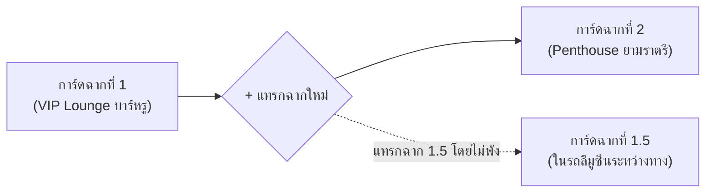

# The Soul Creator Studio — Design & Architecture Bible
*(คัมภีร์การออกแบบและสถาปัตยกรรมระบบสร้างตัวละครและสร้างโลก: The Muse & Genesis Studio)*

> **"Deciding what not to do is as important as deciding what to do."** — Steve Jobs  
> ปรัชญาการออกแบบหน้าสตูดิโอสร้างโลกและตัวละครของ The Soul: **"จากผืนผ้าใบที่ว่างเปล่า สู่การตกผลึกระดับมาสเตอร์พีซผ่านบทสนทนา (Conversational Co-Creation Sanctuary)"**

---

## 1. Core Philosophy & The Antigravity Paradigm Shift (ปรัชญาหลัก)

### 1.1 จาก "ฟอร์มกรอกข้อมูลที่น่าเบื่อ" สู่ "Co-Creation Sanctuary"
- **จุดบกพร่องของระบบเดิมทั่วไป:** เมื่อเปิดเข้ามาผู้ใช้จะพบหน้าต่างรกตา เต็มไปด้วยฟอร์มเปล่า 50 ช่อง และการ์ดทึบๆ กองทับถม ก่อให้เกิดอาการ **Creative Block** (สมองตื้อ ไม่รู้จะเริ่มกรอกอะไร)
- **สัจธรรมใหม่ของ The Soul Studio:** 
  1. **ผืนผ้าใบที่ว่างเปล่า (Blank Canvas):** เปิดเข้ามาเป็นห้องแชทมินิมอล คลีน 100% ไร้สิ่งรบกวนสายตา
  2. **Conversational Discovery:** ผู้เล่นคุยเล่าความฝัน ไอเดีย อารมณ์ หรือไวบ์ของตัวละครและโลกกับ The Muse อย่างอิสระ
  3. **Autonomous Planning Mode:** เมื่อข้อมูลตกผลึก AI จะตรวจจับความหนาแน่นของบริบทและแปลงเป็น "โหมดวางแผน" คล้ายประสบการณ์ใน Google Antigravity ทันที

---

## 2. The Left Sanctuary: ห้องแชทสร้างโลก (The Muse Chat)

พื้นที่ฝั่งซ้ายใช้ **Design Parity แบบ 1:1 กับห้องแชทสำหรับผู้เล่นจริง** เพื่อให้ครีเอเตอร์สัมผัสได้ถึงอารมณ์ของเกมตั้งแต่วินาทีแรกที่สร้าง:

```
+-------------------------------------------------------------------------+
| [Top Bar: The Muse Co-Creator | Status: Ready | Reset | View All Cards] |
+-------------------------------------------------------------------------+
|                                                                         |
|                                                                         |
|        [AI Bubble: Apple Charcoal #2f2f35]                              |
|        "ยินดีต้อนรับสู่ The Soul Studio วันนี้เราจะสร้างใครขึ้นมาดีครับ?"  |
|                                                                         |
|                                       [User Bubble: Velvet Carmine]     |
|                                       "อยากได้ตัวละครสาวนักสืบเย็นชา     |
|                                        แต่งตัวสไตล์ Techwear ดำด้าน..."   |
|                                                                         |
|  ✦ The Muse วิเคราะห์แรงขับและสรีระตัวละคร                                 |
|                                                                         |
|  [Planning Mode Capsule]                                                |
|  "ตอนนี้เราพร้อมสำหรับ 2 การ์ดแล้วนะ:                                      |
|   1. การ์ดสรีระ & ชุด Techwear                                          |
|   2. การ์ดจิตวิทยา & ความลับ                                            |
|   ต้องการคุยต่อ หรือเริ่มสร้างการ์ดเลยดีครับ?"                               |
|                                                                         |
|  [ 🚀 เริ่มลุยได้เลย (Interactive Button) ]                               |
|                                                                         |
+-------------------------------------------------------------------------+
|  (+) [ กล่องพิมพ์หมอนมน Pillow Glass Recipe... ] [🎙️] [ ➔ Carmine Send ]  |
+-------------------------------------------------------------------------+
```

### 2.1 Design Tokens ฝั่งแชท (ถอดแบบจาก Chat Room 100%)
- **Canvas Base:** สีดำด้านเนื้อแมตต์ `#090909` หรือ `#0F0F0F` ถนอมสายตาระดับลึก
- **Chat Input Bar Pillow Recipe:**
  - รูปทรง: แคปซูลหมอนมนเต็ม (`rounded-full`), สูง `min-h-[46px] sm:min-h-[48px]`
  - ผิวกระจก: `bg-white/[0.06] hover:bg-white/[0.09] focus-within:bg-white/[0.10] backdrop-blur-2xl border border-white/[0.10] focus-within:border-white/20 shadow-[inset_0_1px_0_rgba(255,255,255,0.12)]`
  - ปุ่มส่งคาร์ไมน์เรด: ทรงกลม 32px–34px `bg-[#EF264C] hover:bg-[#d91d40] text-white border border-white/20 shadow-[0_2px_8px_rgba(239,38,76,0.35)]`
- **บับเบิ้ลบทสนทนา (Chat Bubbles):**
  - **The Muse (AI):** Apple Charcoal `#2f2f35`, ตัวหนังสือขาวนวล `#F1F1F1` `text-[15px]`, Speech Tail ด้านล่างซ้าย
  - **Creator (User):** Velvet Carmine Gradient (`from-[#D22147] via-[#B8163A] to-[#8E0D29]`), ตัวหนังสือขาวคม `#FFFFFF`, Speech Tail ขวาล่าง
  - **Stage Action Direction:** ตัวเอียงสีเงินเงาจันทร์ `#A1A1A8` นำทางด้วยดาวจิ๋วสีเงิน `✦`

---

## 3. Autonomous Planning Mode & Interactive CTA (โหมดวางแผน)

หัวใจของประสบการณ์แบบ Antigravity ใน The Soul Creator Studio:

### 3.1 การตรวจจับและกระตุ้นโหมดวางแผน (Trigger Mechanism)
- **Single-Card Ready:** เมื่อคุยเฉพาะเจาะจงเรื่องใดเรื่องหนึ่งจนครบถ้วน (เช่น ชุดและทรงผม) AI จะส่งท้ายข้อความพร้อมปุ่มตัวเลือก:
  > *"ตอนนี้ข้อมูลในส่วน 'การ์ดสรีระ & ภาษากาย' ชัดเจนแล้วนะ อยากสร้างการ์ดนี้เลยไหม?"*
- **Multi-Card Synthesis (Planning Mode):** เมื่อการคุยครอบคลุมหลายหัวข้อ AI จะเปิดกรอบ **โหมดวางแผน** สรุปการ์ดทั้งหมดที่จะสร้าง พร้อมแจกแจงหัวข้อสั้นๆ
- **Dual Confirmation Method:**
  1. **Interactive Button:** ปุ่มแคปซูลกระจกฝ้าเรืองแสงอ่อนคาร์ไมน์ `[ 🚀 เริ่มลุยได้เลย ]` แตะครั้งเดียวสร้างทันที
  2. **Conversational Command:** พิมพ์ข้อความว่า *"ลุยเลย"*, *"สร้างเลย"*, *"จัดไป"* AI จะตรวจจับและเริ่มสร้างการ์ดทันทีเช่นกัน

---

## 4. The Right Studio Inspector: แผง HUD อัจฉริยะ (Right Panel)

แผงฝั่งขวาทำหน้าที่เป็น **Live Blueprint HUD** ที่จะเปิด-ปิดและปรับตัวตามสมาธิของครีเอเตอร์อย่างสมบูรณ์แบบ:

### 4.1 จังหวะการเปิด-ปิด (Unfold & Fold Lifecycle)
- **เริ่มต้น (Default State):** พับเก็บสนิท 100% (`isCollapsed = true`) ไม่แย่งสายตา
- **เด้งเปิดอัตโนมัติ (Auto-Unfold):**
  1. เมื่อระบบก้าวเข้าสู่ **"โหมดวางแผน (Planning Mode)"**
  2. เมื่อ **การ์ดสร้างเสร็จสดๆ ร้อนๆ (Card Ready Event)** เพื่ออวดผลงานให้ครีเอเตอร์ชื่นชม
- **อิสระในการพับเก็บ:** มีปุ่มพับเก็บ (Collapse / Close) ให้ผู้เล่นกดปิดเพื่อกลับไปคุยต่อได้ตลอดเวลา และจะเด้งใหม่อีกครั้งเมื่อการ์ดถัดไปพร้อม

### 4.2 การจัดวางแบบ Responsive Fluid Grid & Resizable Splitter
- มีตัวกั้นปรับขนาดได้ (**Resizable Splitter**) ที่ผู้ใช้สามารถลากขยายความกว้างได้อิสระ
- **Layout Adaptability:** การ์ดจะไม่ยึดติดกับ 1 คอลัมน์ยาวแคบๆ:
  - **ความกว้างปกติ (380px – 480px):** แสดงผล 1 คอลัมน์ เรียงลงมาอย่างประณีต
  - **เมื่อลากขยายกว้างขึ้น (600px – 900px+):** ระบบ CSS Grid จะปรับเป็นการ์ด **2 หรือ 3 คอลัมน์อัตโนมัติ** แสดงสเตตัสและมิติของโลกได้เต็มตา
- **โหมดเต็มจอ (Full-Screen Focus Mode):**
  - มีปุ่มขยายการ์ดเต็มจอ (Full Viewport)
  - เข้าสู่ **Direct Manipulation Mode:** ตรวจทาน อ่านรายละเอียดเชิงลึก และแก้ไขข้อความหรือเลื่อนสเตตัสบนการ์ดได้โดยตรงด้วยมือ
  - กดปิดโหมดเต็มจอเพื่อยุบกลับสู่ห้องแชท

---

## 5. Smoked Crystal Glass Recipe (สูตรกระจกคริสตัลรมควันสำหรับการ์ด)

ทุกการ์ดบนแผงขวา จะใช้สูตรเดียวกับ **การ์ดท่าทาง (Stance), การ์ดเวลา (Weather), และการ์ดหลอดความสัมพันธ์ (Gauge)** ใน HUD ของห้องแชทผู้เล่น:

### 5.1 CSS & Tailwind Recipe
```css
/* Smoked Crystal Glass Spec */
background: rgba(255, 255, 255, 0.04);
backdrop-filter: blur(24px);
-webkit-backdrop-filter: blur(24px);
border: 1px solid rgba(255, 255, 255, 0.07);
box-shadow: inset 0 1px 0 rgba(255, 255, 255, 0.08);
border-radius: 20px;
transition: all 0.2s cubic-bezier(0.16, 1, 0.3, 1);
```

### 5.2 กฎความงามและการเลือกสี (Zero-Glow & Dual-Tone)
- **ห้ามใส่ Neon Glow หรือ Drop Shadow หนาๆ เด็ดขาด:** ใช้การยกตัวด้วยความสว่างของกระจก 4% และเส้นขอบ Hairline 1px แทน
- **Typography:**
  - หัวข้อการ์ด (Card Title): ขาวนวลตา `#F1F1F1` `font-semibold text-[15px]`
  - ค่าสเตตัส / รายละเอียด: สีเทา Neutral Gray `#AAAAAA` หรือ `#D6D6DC` `text-[13px] leading-relaxed`
  - หลอดสเตตัส (Progress Bars): เส้นเกจบางละมุน น้ำหนักปกติ `font-normal` ไม่อ้วนหนา
  - ชิปและแท็ก (Pills): ทรงแคปซูลมนเต็ม `rounded-full` ขอบ 1px

---

## 6. Zero Empty Clutter & Overview Blueprint Policy

### 6.1 ไม่แสดงการ์ดว่างเปล่าให้รกตา (Zero Empty Clutter)
- ในโหมดปกติ ระบบจะแสดง **เฉพาะการ์ดที่สร้างเสร็จแล้วเท่านั้น**
- หากคุยจบแค่การ์ดสรีระ ฝั่งขวาจะมีเพียงการ์ดสรีระใบเดียว ลอยเด่นสวยงาม ไม่มีการ์ดเปล่า 10 ใบมากองให้เสียอารมณ์

### 6.2 ปุ่ม "ขอดูการ์ดทั้งหมด (View All Blueprint Cards)"
- ผู้เล่นสามารถกดเพื่อตรวจเช็กโครงสร้างรวมของโปรเจกต์ได้
- **สไตล์การ์ดที่ยังไม่มีข้อมูล (Empty State):** ใช้การออกแบบแนว Editorial Luxury:
  - พาดหัวใหญ่ ชัดเจน มีพลัง: **`✦ ยังไม่มีข้อมูลการ์ดนี้`**
  - คำอธิบายสั้นๆ สีเทาว่าการ์ดนี้ต้องการข้อมูลประเภทไหน
  - ปุ่ม Action กระจกฝ้า: `[ 💬 คุยเรื่องนี้กับ The Muse ]` กดปุ่มนี้แล้วระบบจะส่งข้อความชวนคุยหัวข้อนี้ในแชทให้ทันที!

---

## 7. Conversational Revision via Planning Mode (การสั่งแก้ไขการ์ดเดิมผ่านแชท)

ผู้เล่นสามารถปรับปรุงการ์ดที่สร้างไปแล้วได้โดยไม่ต้องเริ่มใหม่:
1. **พูดคุยแจ้งความประสงค์:** เช่น *"ขอปรับการ์ดสรีระหน่อย อยากให้เปลี่ยนเป็นผมสั้นสีเงิน และเพิ่มรอยสักที่คอ"*
2. **The Muse ปรับจูนไอเดีย:** แลกเปลี่ยนและยืนยันรายละเอียด
3. **เข้าสู่โหมดวางแผนแก้ไข (Revision Planning Mode):**
   - AI แสดงการเปรียบเทียบจุดที่จะเปลี่ยน (Diff Proposal)
   - สรุปว่า: *"พร้อมอัปเดตการ์ดสรีระ & ภาษากาย แล้วนะ ลุยเลยไหม?"*
4. **Patch In-Place:** เมื่อกดยืนยัน ระบบจะเข้าไปทำการเขียนทับเฉพาะการ์ดนั้นทันที โดยไม่กระทบการ์ดใบอื่น

---

## 8. Modular Railroad & World Architecture (ระบบรางรถไฟสร้างโลก)

ปฏิวัติสถาปัตยกรรมฉากและสถานที่ในโลก: **1 การ์ด = 1 สถานที่ / 1 อีเวนต์**



### 8.1 ข้อดีระดับสถาปัตยกรรม
- **Deep Inspection:** ผู้เล่นตรวจเช็กความลึกซึ้งของแต่ละสถานที่ได้อย่างละเอียดว่า บรรยากาศ แสงเงา อุณหภูมิ ท่าทางตัวละครในฉากนั้นตรงใจหรือยัง
- **Zero Breaking Insertion:** สามารถแทรกฉากใหม่ระหว่างฉากเดิมได้อิสระ ไม่ทำให้ ID หรือลำดับเหตุการณ์เดิมพัง
- **Re-order by Dragging:** สามารถลากสลับลำดับการเดินเรื่องของสถานที่ต่างๆ ได้อย่างลื่นไหล

---

## 9. Card-by-Card Catalog (แคตตาล็อกการ์ดมาตรฐาน)

### 9.1 ฝั่งตัวละคร (Character Blueprint Cards)
1. **การ์ดสรีระ รูปลักษณ์ และชุด (Appearance, Outfits & Kinematics)**
2. **การ์ดจิตวิทยา นิสัย และแรงขับลึก (Psychology, Shadow Self & Core Drive)**
3. **การ์ดสเตตัส 7 แกนหลัก & สกิลเฉพาะตัว (Primary Stats & Perks)**
4. **การ์ดปูมหลัง ปมชีวิต และวิวัฒนาการ (Lore, Backstory & Secrets)**

### 9.2 ฝั่งโลก (World Blueprint Cards)
1. **การ์ดจุดเกิดเริ่มต้น & สเตตัสฉากแรก (`Spawn Core` — สถานที่, เวลา, อากาศ, ชุด, ท่าทางเปิดตัว)**
2. **การ์ดสถาปัตยกรรมฉากและสถานที่แต่ละแห่ง (`Modular Location Nodes` — 1 การ์ดต่อ 1 สถานที่)**
3. **การ์ดกาลเวลา บรรยากาศ และสภาพอากาศของโลก (`World Weather & Atmosphere`)**
4. **การ์ดบทนำ ไทม์ไลน์ และเควสเรื่องราว (`World Prologue & Scenario Engine`)**

---

## 10. Proactive Gap-Filling (บทบาท Showrunner ของ The Muse)

เมื่อสร้างหรืออัปเดตการ์ดเสร็จในแต่ละช่วง The Muse จะไม่นิ่งเฉย แต่จะทำหน้าที่เป็น **Executive Producer / Showrunner**:
- ตรวจสอบพิมพ์เขียว (Blueprint Completeness Audit)
- เอ่ยทักชวนคุยในส่วนที่ยังขาดอย่างเป็นมิตร:
  > *"เยี่ยมมาก! ตอนนี้ตัวละครเรามีสรีระ นิสัย และปูมหลังที่แน่นมากแล้ว... แต่โลกใบนี้ยังขาด 'จุดเกิดเริ่มต้นและบรรยากาศฉากแรก' นะครับ เรามาคุยฉากเปิดเรื่องกันเลยไหม?"*

---

*เอกสารฉบับนี้ถือเป็นพิมพ์เขียวหลัก (Authoritative Blueprint) สำหรับการพัฒนา UI/UX และ Component Architecture ของ The Soul Creator Studio สืบไป*
